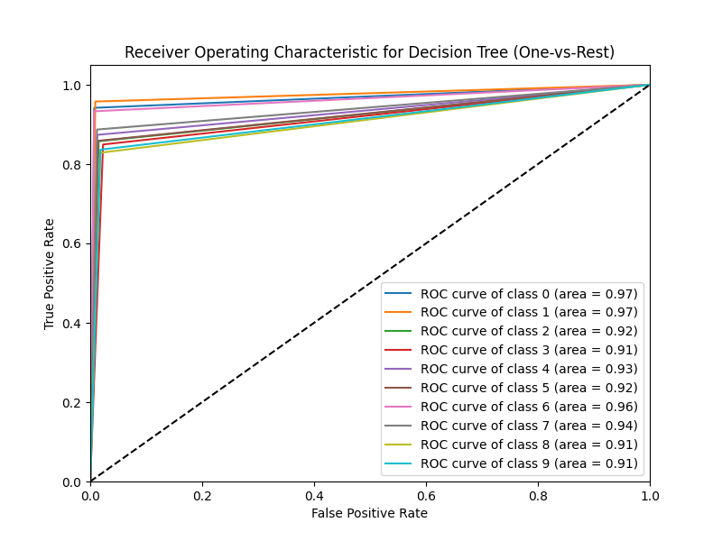

# MNIST-Reader

## Projet Description
The goal of this project is to discover jupyter notebook and scikit learn library using the famous MNIST handwritten digits dataset.
MNIST stands for Modified National Institute of Standards and Technology dataset.

## Dataset description

The dataset used for this project is an open source dataset you can download the dataset **[here](https://www.kaggle.com/datasets/oddrationale/mnist-in-csv?resource=download)**
There are two csv files (train and test) and each line represents one single handwritten digit picture file and on every line we can find the label of the data (to know if it is a '0' or '9' or '5') and a list of numbers representing the shade of grey of each pixel
Each digit is represented in the dataset as follows

<center>

| Digits | Train | Test |
| :----- | :-------: | --------: |
| 0 | 5923 | 980 |
| 1 | 6742 | 1135 |
| 2 | 5958 | 1032 |
| 3 | 6131 | 1010 |
| 4 | 5842 | 982 |
| 5 | 5421 | 892 |
| 6 | 5918 | 958 |
| 7 | 6265 | 1028 |
| 8 | 5851 | 974 |
| 9 | 5949 | 1009 |
</center>

## Launch the project
Make sure you have already installed **docker** and **docker-compose**

```console
foo@bar:~$ docker-compose up --build
```

## Models Used

In this project, we used the following models for our multi-class classification problem:

1. **Logistic Regression**: A statistical model that uses a logistic function to model a binary dependent variable. Despite its name, it is used in multi-class problems (like ours) using the one-vs-rest technique.

2. **Decision Trees**: A decision support tool that uses a tree-like model of decisions and their possible consequences. They're simple to understand and interpret, and can handle both categorical and numerical data.

## Metrics

To evaluate the performance of the models, we used the following metrics:

- **Accuracy**: This is simply the ratio of correct predictions to total predictions.

- **Precision**: Precision is the ratio of correctly predicted positive observations to the total predicted positives. High precision relates to a low false-positive rate.

- **Recall (Sensitivity)**: Recall is the ratio of correctly predicted positive observations to the all observations in actual class. High recall relates to a low false-negative rate.

- **F1 Score**: The F1 Score is the weighted average of Precision and Recall. Therefore, this score takes both false positives and false negatives into account.

- **ROC AUC**: The ROC (Receiver Operating Characteristic) AUC (Area Under the Curve) is a performance measurement for the classification problems at various threshold settings. ROC is a probability curve and AUC represents the degree or measure of separability.

Here are the plots of ROC AUC for each model:




## Results and Conclusion


### Logistic Regression

- Accuracy: 92.07%
- Precision: 0.92
- Recall: 0.92
- F1 Score: 0.92

The logistic regression model performed well with an accuracy of 92.07%. The precision, recall, and F1 score were all 0.92, indicating that the model balanced the false positives and negatives relatively well.

### Decision Trees

- Accuracy: 87.55%
- Precision: 0.88
- Recall: 0.88
- F1 Score: 0.88

The decision tree model had lower performance compared to logistic regression, with an accuracy of 87.55%. The precision, recall, and F1 score were all 0.88, still indicating good performance but with more room for improvement.

In our experiment, the logistic regression model performed better compared to the decision tree model, as evident by the higher ROC AUC score. However, there is still room for improvement for the decision tree model, possibly by tuning its hyperparameters.

Despite logistic regression's better performance in this scenario, it's important to remember that the choice of model heavily depends on the specific problem and the nature of the data. Each model has its strengths and weaknesses, and might perform differently on different datasets.

The project's code is all available in the Jupyter notebook in this repository.


Thank you


<p align="center">
  <div class="footer">
            &copy; Made with :heart: by me
        </div>
</p>
